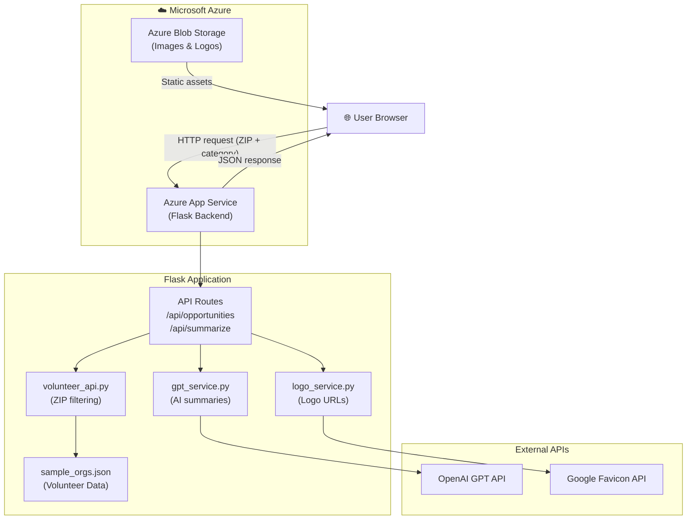

# Pawsome – Volunteer Matching Platform

## Cloud Platform
**Microsoft Azure** – Azure App Service

---

## Description
Pawsome is a cloud-deployed volunteer matching web application that helps users find volunteering opportunities near them. Users enter their ZIP code and optionally filter by category (Animals, Community, Education, Environment, Health, Seniors) to browse a collage-style gallery of organizations. Hovering over any organization card reveals an AI-generated summary of their mission along with direct links to learn more or start volunteering.

---

## Services Used

| Service | Purpose |
|---|---|
| **Azure App Service** | Hosts and runs the Flask web server in the cloud |
| **Azure Blob Storage** | Stores organization logos and static image assets |
| **OpenAI GPT API** | Generates short, volunteer-friendly summaries of each organization |
| **Google Favicon API** | Fetches high-quality brand logos for each organization |
| **Python Flask** | Backend web framework serving both the API and frontend |

---

## How It Works

1. **User visits the site** — Azure App Service serves the Pawsome frontend (HTML/CSS/JS)
2. **User enters a ZIP code** — The frontend sends a request to `/api/opportunities?zip=XXXXX`
3. **Backend filters organizations** — Flask queries the volunteer dataset, matching by ZIP code (exact match, then 3-digit prefix for metro coverage)
4. **AI summarization** — For each organization, the OpenAI GPT API generates a short, friendly summary from the full description
5. **Logo resolution** — The Google Favicon API fetches each organization's brand logo
6. **Results returned** — Flask sends a JSON response to the frontend
7. **Gallery renders** — JavaScript dynamically builds the card grid; hovering a card reveals the AI summary and action buttons

---

## Architecture



---

## Tech Stack

**Backend**
- Python 3.x
- Flask 3.0 + Flask-CORS
- OpenAI Python SDK

**Frontend**
- HTML5 / CSS3 (responsive grid layout)
- Vanilla JavaScript (no frameworks)
- Google Fonts (Playfair Display, Inter)

**Cloud & APIs**
- Microsoft Azure App Service
- Azure Blob Storage
- OpenAI GPT-3.5 Turbo
- Google Favicon Service

---

## Project Structure

```
Pawsome/
├── backend/
│   ├── app.py                  # Flask entry point, serves frontend + API
│   ├── data/
│   │   └── sample_orgs.json    # Curated volunteer organization dataset
│   ├── models/
│   │   └── opportunity.py      # Opportunity data model
│   ├── routes/
│   │   ├── opportunities.py    # GET /api/opportunities
│   │   └── summarize.py        # POST /api/summarize
│   └── services/
│       ├── gpt_service.py      # OpenAI summarization
│       ├── logo_service.py     # Organization logo resolution
│       └── volunteer_api.py    # ZIP-based data filtering
├── Config/
│   └── constants.py            # App-wide constants (spacing, API settings)
├── frontend/
│   ├── css/
│   │   ├── base.css            # Global styles, navbar, hero, layout
│   │   ├── filters.css         # ZIP + category filter bar
│   │   └── gallery.css         # Opportunity card grid and hover overlays
│   ├── js/
│   │   ├── api.js              # Frontend API calls
│   │   ├── filters.js          # ZIP/category input handling + debounce
│   │   ├── gallery.js          # Card grid rendering
│   │   └── hover.js            # Hover overlay behavior
│   ├── index.html              # Home page
│   └── volunteering.html       # Volunteer opportunities gallery page
├── requirements.txt
└── .env.example
```

---

## Running Locally

```bash
# 1. Install dependencies
pip install -r requirements.txt

# 2. Set up environment variables (optional – enables AI summaries)
copy .env.example .env
# Add your OPENAI_API_KEY to .env

# 3. Start the server from the backend folder
cd backend
python app.py
```

Open **http://localhost:5000** in your browser.

**Sample ZIP codes to try:** `10001` (NYC) · `90001` (LA) · `60601` (Chicago) · `77001` (Houston) · `20001` (DC)

---

## Key Features

- **ZIP-code filtering** with metro-area fallback (3-digit prefix matching)
- **Category filtering** — Animals, Community, Education, Environment, Health, Seniors
- **AI-generated summaries** via OpenAI GPT (gracefully degrades without API key)
- **Responsive collage gallery** — adapts to any screen size
- **Hover-reveal cards** — summary + "Start Volunteering" and "Learn More" buttons
- **Logo resolution** with automatic fallback for missing images
